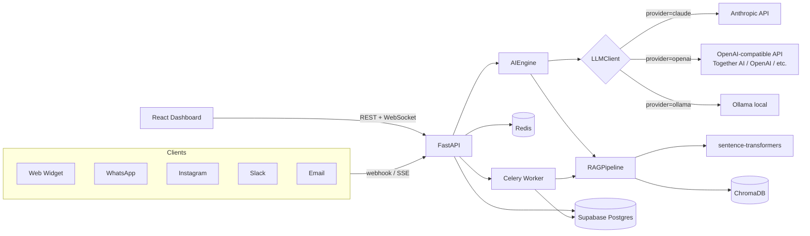

# Lumio — AI Chatbot Platform

[](LICENSE)
[](https://www.python.org/)
[](https://fastapi.tiangolo.com/)
[](https://react.dev/)

> **RAG-powered chatbots for any business — start from a genre preset (support, sales, booking, tutor, coding, character) or write your own system prompt, upload documents, connect WhatsApp / Instagram / Slack / Email from the dashboard, or embed on your site. Runs on Claude, OpenAI, Together AI, *or* fully offline with Ollama.**

**[Live demo →](https://lumio-api-production.up.railway.app)** &nbsp;·&nbsp; **[API docs →](https://lumio-api-production.up.railway.app/docs)** &nbsp;·&nbsp; **[Tech decisions →](docs/decisions.md)**

> 🎥 Replace this paragraph with a 30-second screen recording (`docs/screenshots/demo.gif`) showing: upload PDF → ask question → cited streamed answer → low-confidence handoff to dashboard.


---

## Architecture



Each request flows: channel → FastAPI → `AIEngine` (intent → RAG search →
LLM stream → confidence → handoff decision) → response. Long-running work
(document ingestion, embedding) is offloaded to Celery so the API stays
fast.

---

## Quickstart

**Windows (one click):** double-click **[`start.bat`](start.bat)**.

**Any platform:**

```bash
git clone https://github.com/Aniketsingh12/AI-Chatbot-Platform.git
cd AI-Chatbot-Platform

# Backend (terminal 1)
cd backend
cp .env.example .env                       # works as-is in dev mode (see below)
pip install -r requirements.txt
uvicorn app.main:app --reload --port 8000

# Frontend (terminal 2)
cd frontend
cp .env.example .env
npm install
npm run dev
```

Then open:

- Dashboard → http://localhost:5173
- API docs  → http://localhost:8000/docs

**Prerequisites:** Python 3.11+, Node.js 18+.

> **No Supabase, ChromaDB server, or API keys needed to try it.** With
> `USE_DEV_DB=true` (the default in `.env.example`), Lumio runs entirely
> in-memory — zero external services, data resets on restart. ChromaDB also
> runs **embedded** by default (`CHROMA_MODE=embedded`, on-disk, no separate
> server process). Add a Claude/OpenAI key or set `LLM_PROVIDER=ollama` when
> you want the bot to actually reply. To use a real Supabase database instead,
> set `USE_DEV_DB=false` and fill in `SUPABASE_URL` / `SUPABASE_KEY`.

### Log in

Dev mode ships with three ready-to-use accounts:

| Email                  | Password     |
| ---------------------- | ------------ |
| `admin@botforge.dev` | `admin123` |
| `demo@botforge.app`  | `demo123`  |
| `test@test.com`      | `test123`  |

Or register your own from the signup form (passwords must be 8–72 characters).

> **Note:** the seed email is `admin@botforge.**dev**`, not `.local`. A `.local`
> address is rejected by the email validator (it's a reserved TLD), which is why
> the account moved — logging in with the old address returns `401 Invalid
> credentials`.

Setting `VITE_DEMO_EMAIL` / `VITE_DEMO_PASSWORD` (see
[`frontend/.env.example`](frontend/.env.example)) adds a one-click **Explore the
live demo** button to the login page, so a visitor never has to guess
credentials. Leave them unset on a real deployment and the button doesn't
render.

### Run fully offline / free (no Anthropic, no OpenAI)

**Option A — local models via Ollama:**

```bash
ollama pull llama3.1:8b         # text
ollama pull llava               # vision (optional)
# In backend/.env:
#   LLM_PROVIDER=ollama
#   OLLAMA_MODEL=llama3.1:8b
#   VOICE_PROVIDER=local
```

**Option B — hosted inference via [Together AI](https://api.together.ai)**
(same open-source models, served on their GPUs instead of local CPU):

```bash
# In backend/.env:
#   LLM_PROVIDER=openai
#   OPENAI_BASE_URL=https://api.together.xyz/v1
#   OPENAI_API_KEY=<your Together AI key>
#   OPENAI_MODEL=meta-llama/Llama-3.3-70B-Instruct-Turbo
```

`OPENAI_BASE_URL` works with any OpenAI-compatible endpoint (Together AI,
OpenRouter, Fireworks, a self-hosted vLLM server, ...) — the `openai`
provider talks to whichever one you point it at, with no code changes. See
[`DEPLOY.md`](DEPLOY.md) for a full deployment using this.

Embeddings always run locally via `sentence-transformers`, so RAG works
without a single paid API key either way.

### Optional services

```bash
# Background worker (for async document ingestion — requires Redis)
cd backend && celery -A app.tasks.celery_app worker --loglevel=info
```

The embeddable widget needs no build step — it's served directly by the
backend at `/widget.js`. Activate a bot, connect the Website channel in the
Channels tab, and paste the generated `<script>` tag into any page.

### Seed a sample bot

```bash
cd backend && python ../scripts/seed_demo.py
```

> Populates a demo bot, knowledge base, and conversations in a **real Supabase**
> database. Dev mode already seeds the login accounts above in memory, so you only
> need this script once you've configured Supabase.

---

## What's interesting under the hood

- **Genre presets, not a fixed menu.** A bot isn't hardcoded as a support
  assistant — start from Support, Sales, Booking, Tutor, Coding, or **Character**
  (a free-form persona for casual companion chat). Each genre controls
  grounding strictness (must-cite-sources vs. free conversation) and whether
  low confidence triggers human handoff. All genres share one system-prompt
  builder instead of duplicated per-genre templates. See
  [`app/services/bot_genres.py`](backend/app/services/bot_genres.py).
- **AI prompt generator.** Not everyone writes prompts well — describe the
  bot in plain language ("a friendly bakery bot that helps with orders and
  never discusses refunds over $50") and `POST /api/bots/generate-prompt`
  turns it into a ready-to-edit system prompt, grounded in the bot's chosen
  genre, name, and tone.
- **Self-service channel connections.** Each bot stores its *own* WhatsApp /
  Instagram / Slack / Email credentials (entered from the dashboard, not a
  shared `.env`), so multiple bots can each run their own number or
  workspace. A **Test** button calls the provider's real API and surfaces
  its actual error ("Invalid OAuth access token", `invalid_auth`, ...)
  before you go live. Secrets are masked everywhere except the one save
  response, and webhooks route to the right bot by matching the account
  identity in the incoming payload. See
  [`app/services/channel_registry.py`](backend/app/services/channel_registry.py).
- **Tool-using AI agent.** `POST /api/chat/agent` runs a real agent loop —
  the LLM picks tools (`search_knowledge_base`, `collect_contact`,
  `escalate_to_human`, `get_current_datetime`), we execute them, feed
  results back, and iterate until it's ready to answer. Works on Claude
  (native tool use), OpenAI (function calling), and Ollama (llama3.1+ /
  qwen2.5+). The full tool-call trace ships with every response and is
  persisted on the message for transparency. See
  [`app/services/agent.py`](backend/app/services/agent.py) and
  [`app/services/tools.py`](backend/app/services/tools.py).
- **Streaming SSE chat.** `POST /api/chat/stream` yields tokens live through
  every provider — Claude (`messages.stream`), OpenAI (`stream=True`), and
  Ollama (chunked `/api/chat`). The widget renders with a typing cursor.
  See [`app/services/llm_client.py`](backend/app/services/llm_client.py) →
  `chat_stream`.
- **Per-bot ChromaDB collections** (`bot_{bot_id}`) — full document
  isolation between tenants without a shared filter on every query.
- **Confidence-gated handoff.** The LLM self-reports `[Confidence: X/10]`,
  parsed and combined with intent (`Complaint` → escalate at <70%) to drive
  the handoff decision.
- **Abuse protection on every public entry point.** Chat, auth, and the
  channel webhooks are all rate-limited per IP (`check_rate_limit`) with a
  per-bot daily message cap (`check_bot_quota`) on top, so nobody can run up
  the deployment's LLM bill just by hammering an endpoint. Falls back
  in-memory when Redis isn't configured. See
  [`app/middleware/rate_limiter.py`](backend/app/middleware/rate_limiter.py).
- **Signature-verified webhooks.** WhatsApp/Instagram (`X-Hub-Signature-256`)
  and Slack (`X-Slack-Signature`, with a 5-minute replay window) requests are
  authenticated with HMAC before a single token is spent on them — a bot with
  no secret configured yet still falls back to the rate limiter and daily
  quota instead of being rejected outright. See
  [`app/middleware/webhook_security.py`](backend/app/middleware/webhook_security.py).
- **Test suite mocks the LLM.** `pytest -v` runs the AI engine end-to-end
  against an `AsyncMock` — no API keys, no network.

For the *why* behind these choices, see **[docs/decisions.md](docs/decisions.md)**.

---

## Features

- **Genre presets you can outgrow** — Support, Sales, Booking, Tutor, Coding
  or a **Character/Companion** persona, each with its own grounding and handoff
  behavior. Every one is a starting point: `system_prompt_override` replaces the
  preset entirely, so a bot can be anything you can describe.
- **AI prompt generator** — describe the bot in plain language, get a
  structured system prompt back, edit as needed.
- **Tool-using agent** — LLM autonomously calls tools (search KB, capture
  leads, escalate, etc.) and iterates until done. Works on Claude / OpenAI /
  Ollama.
- **RAG Q&A** — PDF, DOCX, TXT, CSV, URL → chunked → embedded → ChromaDB
  (runs embedded, no separate server needed). Answers cite their sources.
- **Multi-channel, self-service** — Website widget, WhatsApp, Instagram,
  Slack, Email. Connect each one from the dashboard with its own
  credentials and a live **Test** button — no manual `.env` editing or
  server restarts required.
- **Streaming responses** — Server-Sent Events, works through any HTTP proxy.
- **Human handoff** — Low-confidence answers escalate; agents see the
  conversation in real-time via WebSocket.
- **Abuse protection** — Per-IP rate limits and a per-bot daily message quota
  on every public endpoint, plus HMAC signature verification on the
  WhatsApp/Instagram/Slack webhooks, so an anonymous caller can't run up the
  deployment's LLM bill.
- **Analytics** — Top questions, knowledge gaps, channel breakdown,
  satisfaction, resolution rate.
- **Embeddable widget** — Single `<script>` tag for any site; renders in a
  Shadow DOM so it never clashes with the host page's CSS.
- **LLM-agnostic** — Claude / OpenAI / Together AI (or any OpenAI-compatible API) /
  Ollama, configurable per deployment.

## Tech stack

| Layer                     | Tech                                                                                                                                               |
| ------------------------- | -------------------------------------------------------------------------------------------------------------------------------------------------- |
| **Backend**         | FastAPI · Python 3.11 · Pydantic v2 · Pydantic-Settings · Uvicorn                                                                              |
| **Frontend**        | React 18 · TypeScript · Vite · TailwindCSS · Zustand · React Router · Recharts · Axios · native WebSocket                                  |
| **AI / LLM**        | Anthropic Claude · OpenAI GPT-4o · Together AI / any OpenAI-compatible API · Ollama (LLaMA 3.1, LLaVA) · sentence-transformers (`all-MiniLM-L6-v2`) |
| **RAG**             | ChromaDB · LangChain text splitter · PyPDF2 · python-docx · BeautifulSoup                                                                      |
| **Database / Auth** | Supabase (PostgreSQL + Auth + Storage) · zero-config in-memory dev fallback                                                                       |
| **Background jobs** | Celery · Redis                                                                                                                                    |
| **Real-time**       | WebSocket (agent inbox) · Server-Sent Events (chat streaming)                                                                                     |
| **Channels**        | Meta WhatsApp Cloud API · Instagram Graph API · Slack Web API (direct `httpx`, no Bolt SDK) · IMAP / SMTP                                       |
| **Auth & security** | JWT (`python-jose`) · `passlib[bcrypt]` · per-IP/per-bot rate limiting · HMAC webhook signature verification                                  |
| **Tooling**         | Ruff · Pytest · pytest-asyncio · TypeScript strict · ESLint · Prettier                                                                        |
| **Infra**           | Railway (single Docker service: API + dashboard) · Makefile · alt path: Render (backend) + Vercel (frontend)                                    |

## Project structure

```
AI-Chatbot-Platform/
├── backend/                 # FastAPI service
│   └── app/
│       ├── main.py          # App entry point + router wiring + /widget.js
│       ├── config.py        # Pydantic Settings (env vars)
│       ├── database.py      # Supabase client + in-memory dev fallback
│       ├── dev_db.py        # Zero-config in-memory DB (dev mode)
│       ├── static/
│       │   └── widget.js    # Embeddable chat widget (vanilla JS, Shadow DOM)
│       ├── middleware/      # auth, error_handler, rate_limiter,
│       │                    # webhook_security (HMAC verification)
│       ├── routers/         # auth, bots, knowledge, chat, conversations,
│       │                    # analytics, widget, settings, channel_config,
│       │                    # + channels/* (per-platform webhooks)
│       ├── services/        # ai_engine, rag_pipeline, llm_client,
│       │                    # bot_genres, channel_registry, channel_router,
│       │                    # voice_processor, image_processor, ...
│       ├── tasks/           # Celery background jobs
│       ├── prompts/         # YAML prompt templates
│       └── utils/           # File parsing, text splitting
├── frontend/                # React + Vite dashboard
├── docs/
│   ├── architecture.md
│   ├── decisions.md         # ADRs explaining the stack
│   ├── api-reference.md
│   ├── channels.md
│   ├── deployment.md        # legacy Render/Vercel/Railway-Celery guide
│   └── deploy-free.md       # $0/mo path via Render + Vercel + Supabase + Upstash
├── scripts/                 # migrate.py, seed_demo.py, test_whatsapp.py
├── start.bat / start.ps1    # One-click local launcher (Windows)
├── DEPLOY.md                # Current deployment guide (Railway single service, HF Spaces)
├── render.yaml              # Render deploy blueprint
├── railway.toml             # Railway deploy config
└── Makefile                 # `make backend`, `make test`, `make lint`, ...
```

## Testing

```bash
make test          # backend pytest + frontend tests
make lint          # ruff + eslint
make test-backend  # pytest -v (fully mocked, no keys needed)
```

No CI workflow is wired up yet — `make test` / `make lint` are run manually before pushing.

## Documentation

- **[Architecture deep-dive](docs/architecture.md)** — request flow, data model
- **[Tech decisions (ADRs)](docs/decisions.md)** — why this stack
- **[API reference](docs/api-reference.md)** — every endpoint
- **[Channels setup](docs/channels.md)** — connecting WhatsApp, Instagram,
  Slack, Email per bot from the dashboard
- **[Deployment guide](DEPLOY.md)** — current setup: Railway single service, or
  Hugging Face Spaces + Vercel
- **[Free deployment walkthrough](docs/deploy-free.md)** — Render + Vercel +
  Supabase + Upstash, step by step
- **[Legacy deployment notes](docs/deployment.md)** — superseded by `DEPLOY.md`

> **Before deploying anywhere real:** change `JWT_SECRET` in `backend/.env`
> away from the placeholder value — it ships in `.env.example`, so leaving it
> unchanged lets anyone forge a valid login token.

## License

MIT — see [LICENSE](LICENSE).

## Author

Built by **[Aniket Singh](https://github.com/Aniketsingh12)** as a portfolio
project.
